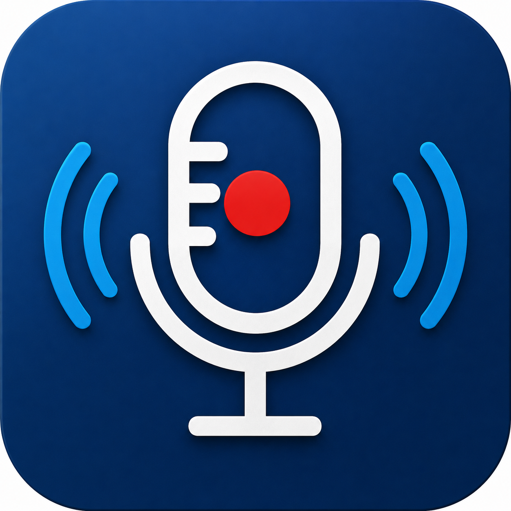
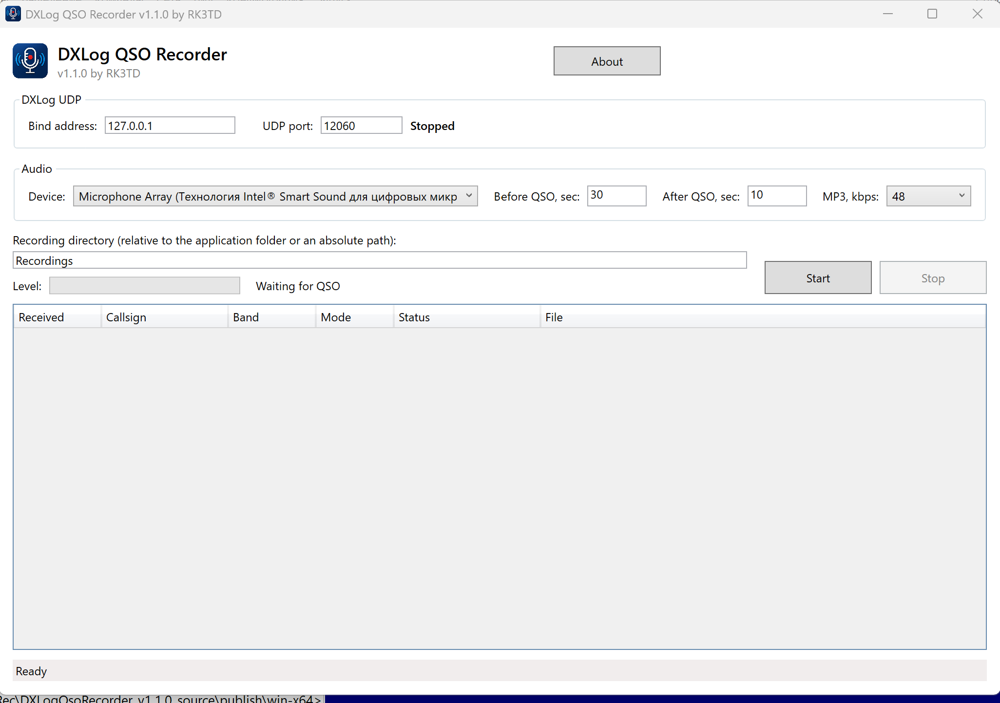

<p align="center">
  
</p>

<h1 align="center">DXLog QSO Recorder</h1>

<p align="center">
  Portable per-QSO audio recorder for DXLog.net on Windows 10/11.
</p>

<p align="center">
  <a href="../../actions/workflows/build.yml"></a>
  <a href="LICENSE"></a>
  
  
</p>

## Overview

DXLog QSO Recorder listens for DXLog.net `contactinfo` XML messages over UDP and automatically saves a separate audio fragment for every new QSO.

The application is distributed as a **portable Windows application**. It does not require installation and does not use the Windows Registry.

## Features

- Windows audio capture-device selection;
- circular pre-buffer from 1 to 600 seconds;
- post-buffer from 0 to 600 seconds;
- MP3 output at 32, 48, or 64 kbps;
- automatic WAV fallback if MP3 encoding fails;
- first-channel extraction from multichannel sources;
- normalization to 24,000 Hz, 16-bit PCM, mono;
- DXLog.net `contactinfo` XML reception over UDP;
- default local bind address `127.0.0.1`;
- contest-based recording directories;
- portable settings, logs, packets, temporary files, and recordings;
- no automatic deletion of recordings.

## Download

Download the latest ready-to-run Portable ZIP from the repository's **Releases** page. The package is self-contained and does not require a separate .NET installation.

Windows may display a SmartScreen warning for an unsigned executable. Verify that the file came from this repository's Releases page before running it.

## File naming and storage

Recordings are grouped by the contest name supplied by DXLog.net:

```text
Recordings/
  CQ-M/
  CQ WW CW/
  Russian DX Contest/
  Unknown/
```

File names use this format:

```text
yyyyMMdd_HHmmss_MYCALL_CALL_BAND_MODE.mp3
```

Example:

```text
20260730_142804_RT2C_RN3TT_21MHz_CW.mp3
```

## DXLog.net configuration

Recommended local UDP settings:

```text
Address: 127.0.0.1
Port:    12060
```

Use the same values in DXLog QSO Recorder. See [DXLog.net setup](docs/DXLOG_SETUP.md) for a basic test procedure.

## Audio processing

Before MP3 encoding, the source is converted to:

```text
Channel:     first channel only
Sample rate: 24,000 Hz
Sample type: 16-bit PCM
Channels:    mono
```

This permits mono, stereo, four-channel, and other multichannel capture devices to be used without passing an unsupported channel count to LAME. If conversion or MP3 encoding fails, the original recording is retained as WAV.

## Building from source

Requirements:

- Windows 10 or Windows 11;
- .NET 8 SDK.

Run:

```text
build-portable-win-x64.cmd
```

Or use PowerShell:

```powershell
powershell.exe -ExecutionPolicy Bypass -File .\build-portable-win-x64.ps1
```

The portable output is written to:

```text
publish/win-x64
```

The first build requires internet access to restore NuGet packages.

## Runtime data

All data is stored relative to the application directory:

```text
Data/settings.json
Logs/recorder.log
Packets/
Temp/
Recordings/
```

## Contributing and support

- Read [CONTRIBUTING.md](CONTRIBUTING.md) before submitting changes.
- Use GitHub Issues for reproducible bugs and focused feature requests.
- See [SUPPORT.md](SUPPORT.md) for the information to include.
- Security issues should be reported according to [SECURITY.md](SECURITY.md).

## Third-party components

- NAudio — MIT License
- NAudio.Lame — .NET wrapper for LAME
- LAME MP3 Encoder — GNU LGPL

See [THIRD_PARTY_NOTICES.txt](THIRD_PARTY_NOTICES.txt).

## License

DXLog QSO Recorder is released under the [MIT License](LICENSE).

## Screenshot



## Author

Sergey Zimin (RK3TD)  
© 2026 Sergey Zimin
